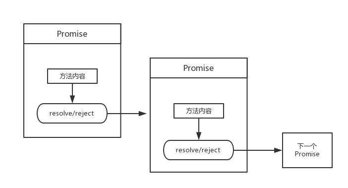

title: 详解 Promise 
tags:
  - promise
  - js

date: 2017-03-08 16:54:54
---

偶然看到一篇介绍 Promise 的文章，这个概念也出现好久了，之前一直用着 [whenjs](https://github.com/cujojs/when), 但是一直没有时间自己写一个。

于是下定决心，自己写一个吧~ 毕竟别人都能写出来的东西，而且工作的时候都是在写一些业务型的代码，感觉非常没有创造性~

---

Promise 用起来挺简单的，可以很好的解决 js callback 多的时候，缩进很烦的问题。而且线性的写代码也更容易理解~

现在写这篇文章，就是高中的时候写作文一样，看到题目就开始辗转反侧，脑子里面想好多内容，理清了思路，但是拿起笔就全忘了。

今天在开始写之前我也下了好大的决心，在代码上面写了大片的注释，感觉写这一篇应该会很顺利吧，结果还是事与愿违，写了些乱七八糟的东西。

这篇文章主要是介绍 Promise 的用法以及我是怎么实现这么一个库的，但是该怎么开始写呢？于是我列了几个要点，概念，原理，实现，感觉填充起来会比较容易吧，嗯，就这么办吧~

## 规范 
[Promise/A+ 规范](https://promisesaplus.com)
[ES6 Promise](https://tc39.github.io/ecma262/#sec-promise-objects) --- 加载比较慢~ 想看就耐心等~

两个规范在这了，其实现在用的多的是 Promise/A+ 规范，看起来还是很简单的。

## 概念
Promise 就是承诺，会按照 then 的顺序做些事情，出了问题会在 catch 里面。像这样：

```js
var p =
  new Promise(function (resolve) {
    setTimeout(function () {
      resolve(true);
    }, 1000);
  })
  .then(function (result) {
    console.log('result:', result);
  })
  .catch(function(err) {
    console.log('error:', err);
  });

```

## 原理

要说 Promise 的原理，我就假设大家都会用了，要不然看这个干什么~ 当然每个人的想法是不一样的，我开始了~

以前面试的时候经常会被问到这个问题，你知道 Promise 是怎么实现的吗？ 我说不知道，大概就是有一个数组，for 循环执行吧。2333333333333~

现在看来是不能用 for 循环来实现 Promise 了，假如好多 Promise 都是耗时间的操作，每个 Promise 的结束时间就不能控制，要等到前一个 Promise 结束之后，主动通知下一个 Promise 执行。所以就要求 Promise 里要保存下一个 Promise 的引用，方便在执行完当前 Promise 的时候调用下一个。

什么时候才是 Promise 执行结束的标志呢？就是在 then 的回调函数里面调用了 resolve(value) 或者 reject(err)的时候。所以调用下一个 Promise 的地方就在这两个方法里面。

这样看起来，Promise 的调用过程，一个结束调用另外一个，有点像链表~



## 实现

### 链式调用

首先考虑两种 Promise 的调用方式

```js
// 1.chain
new Promise(noop)
  .then(function fn1() {})
  .then(function fn2() {})
  .then(function fn3() {});

// 2.
var p = new Promise(noop);
p.then(function fn1() {});
p.then(function fn2() {});
p.then(function fn3() {});
```

第一种链式的调用方法是按照顺序执行 fn1, fn2, fn3 的意思~ （then 方法会返回新的 Promise 对象，这句话放在这里好像很奇怪~），每一次 .then 都像是连接着一个新的 Promise。

而第二种写法，fn1, fn2, fn3 是同时开始执行的~  一个 Promise 连着三个不同的 Promise 形成了三条 Promise 调用链~


### 构造函数

然后说到构造函数，毕竟初始化 Promise 是在这里面进行的。

```js
function Promise(resolver) {
  if (!util.isFunction(resolver)) {
    throw new TypeError('resolver must be a function');
  }

  // 默认是 pending 状态
  this.state = PENDING;
  // resolve 的值
  this.value = 0;
  // 保存接下来要执行的 promise 的数组，数组里面的元素是 Executor，
  // 包装了 Promise 及其onReject, onResolve 方法
  // then 方法可能会添加 Executor 到这个数组，也只有 then 方法会添加元素到这个数组
  this.queue = [];

  if (resolver !== util.noop) {
    this.__callThen(resolver); // call thenable.
  }
}

Promise.prototype.then = function (onResolved, onRejected) { ... }
Promise.prototype.catch = function (onResolved, onRejected) { ... }

/*
 * 上面提到的 Executor
 */
function Executor(promise, onResolved, onRejected) {
  this.promise = promise;
  this.onRejected = onRejected;
  this.onResolved = onResolved;
}
```

Promise 大概是这三个函数使用的比较多，当然还有几个静态方法，或者 delay 方法 。

这里应该写点什么呢，代码里面稍微有点注释，Promise 的数据结构就像构造函数里面写的，初始化 Promise 的函数 `function (onResolved, onReject) {}` 与 then 方法的参数 `function (onResolved, onReject) {}` 形式是一样的，被称为 **thenable**

参数被传递进构造函数之后，稍做休息，便直接开始执行了（放在 timeout 里面执行，还是要稍等一下的）。就是在 `__callThen` 方法里面执行，这个方法也很重要，就是对 thenable 函数 try-catch 一下~ 出现异常当然要拒绝。

```js
/**
 * 调用 then 方法，同时会 try catch 一下，
 *    如果出错，就 doReject（err）
 *    如果没错，就 doResolve（value）
 */
Promise.prototype.__callThen = function (then) {
  var called = false;
  var self = this;

  function resolve(value) {
    if (!called) {
      called = true;
      self.doResolve(value);
    }
  }

  function reject(e) {
    if (!called) {
      called = true;
      self.doReject(e);
    }
  }

  try {
    then(resolve, reject);
  } catch (e) {
    if (!called) {
      called = true;
      this.doReject(e);
    }
  }
};
```

好了，到现在为止，then 方法之前的内容就会执行到这里。

这一段的 主要内容就是，够造了一个 Promise（会执行传入的 thenable 函数）， 还没有涉及到 then。

### Then 函数

在 then 方法里面，queue 数组终于派上了用场，因为可能会添加 Executor 到 queue 里面去，当构造 Promise 的 thenable 执行很慢的话~ 

如果当前 promise 已经被 RESOLVED 或者 REJECTED，那就直接执行 onResolved 或者 onRejected。
 
```js
Promise.prototype.then = function (onResolved, onRejected) {
  var promise2 = new Promise(util.noop);
  
  // state 默认就是 PENDING，如果完成 或者失败会改变
  // 如果在 then 方法里面还是 PENDING 的话，说明前一个过程还没有结束
  if (this.state !== PENDING) {
    var dummy = this.state === FULFILLED
              ? onResolved
              : onRejected;
    promise2.__runInOrder(dummy, this.value);
  } else {
    this.queue.push(new Executor(promise2, onResolved, onRejected));
  }

  return promise2;
};

// 为什么叫 run in order 呢，我实在是词穷，不过 fn 传递到此函数之后，
// 会在下一个 tick 按顺序执行，仅此而已~
Promise.prototype.__runInOrder = function (fn, value) {
  var self = this;
  setTimeout(function () {
    var ret;
    try {
      ret = fn(value);
    } catch (e) {
      return self.doReject(e);
    }

    if (ret === self) {
      self.doReject(new TypeError('Cannot resolve promise with itself.'));
    } else {
      self.doResolve(ret);
    }
  });
};

```


接下来的两个方法比较最重要，上面可能看到过很多次他们的身影，但我都没有说过，最开始的时候我说前一个 promise 完成的时候要通知下一个 promise，这个通知的过程就在这两个方法里进行的。

有一点不同的是：doResolve 方法要检查前一个 promise 返回的值，如果前一个 promise 完成时返回了一个新的 promise，那么肯定要等这个返回的 promise 执行完成之后再 doResolve，而 doReject 就很直截了当了，反正你出错了，不要再执行了，然后就报错了~

### doResolve

前面说了太多这里没什么好写的了，看看代码吧~

```js
Promise.prototype.doResolve = function (value) {
  try {
    var then = util.getThen(value);
    if (then) {
      this.__callThen(then);
    } else {
      this.state = FULFILLED;
      this.value = value;
      // Executor 的 doResolve
      this.queue.forEach(function (item) {
        item.doResolve(value);
      });
    }

    return this;
  } catch (e) {
    return this.doReject(e);
  }
};

// 如果 onResolved 不是函数就继续执行下一个 promise， 这是规定~
Executor.prototype.doResolve = function (value) {
  if (util.isFunction(this.onResolved)) {
    this.promise.__runInOrder(this.onResolved, value);
  } else {
    this.promise.doResolve(value);
  }
};
```

### doReject

```js
Promise.prototype.doReject = function (err) {
  this.state = REJECTED;
  this.value = err;
  this.queue.forEach(function (item) {
    item.doReject(err);
  });

  return this;
};

// 同上
Executor.prototype.doReject = function (err) {
  if (util.isFunction(this.onRejected)) {
    this.promise.__runInOrder(this.onRejected, err);
  } else {
    this.promise.doReject(err);
  }
};
```

好像概念都写完了。

Github： [ochukai/promise](https://github.com/ochukai/promise)
